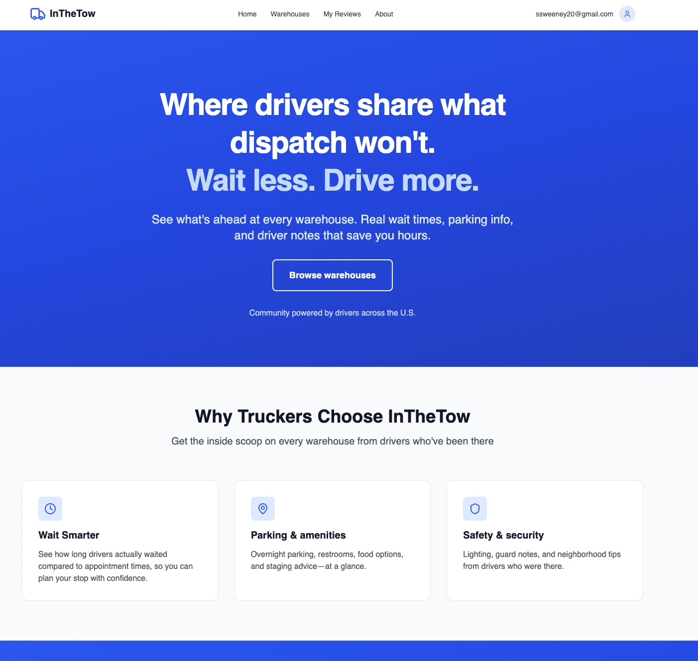
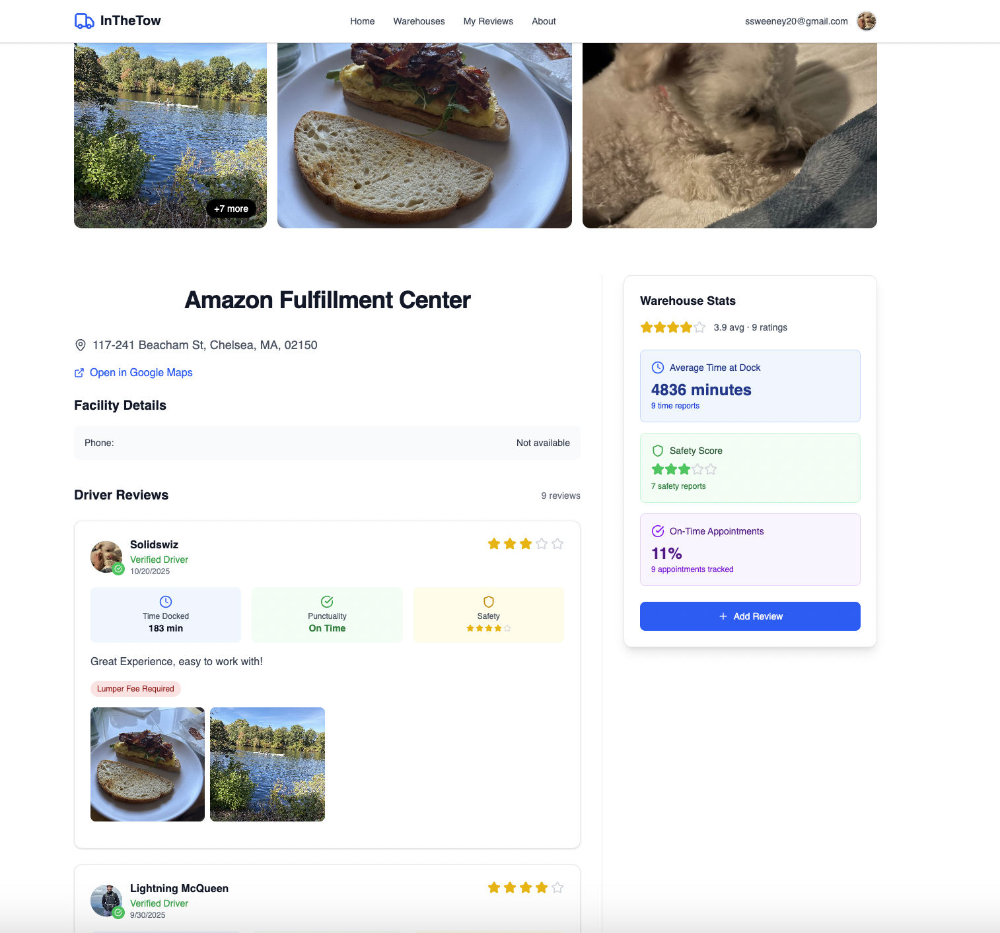
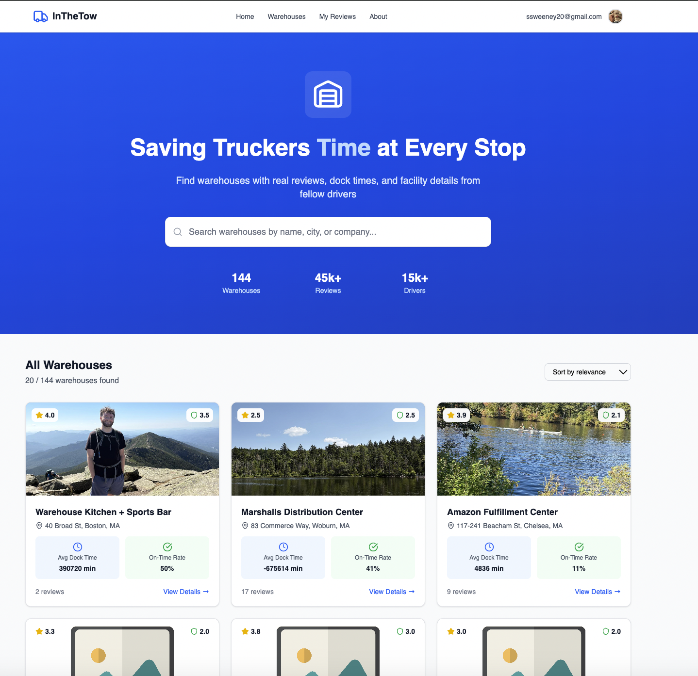

# InTheTow

**Real warehouse insights. Wait less. Drive more.**  
InTheTow is a full stack MERN (MongoDB, Express, React, Node.js) web app that helps truck drivers share and view warehouse information like wait times and parking availability, saving time and improving efficiency.

---

## Screenshots

### Home Page

### Warehouse Details Page

### Warehouse Browser

---

## Tech Stack

**Frontend:**
- React 
- JWT based authentication via global context
- Responsive UI 

**Backend:**
- Node.js + Express
- MongoDB + Mongoose
- AWS S3 for image uploads (signed URL system)
- JSON Web Tokens for secure user sessions

---

## Features

- **Driver Reviews** — See first hand experiences from other drivers.
- **Wait Time Tracking** — Compare appointment vs. actual dock times.
- **Safety & Security** — Safety score, and neighborhood details from drivers.
- **Photo Uploads** — Drivers can add images via secure S3 uploads.
- **User Authentication** — Secure signup, login, and password change flow.

---
